# 📦 Inventori Toko | UAS Pemrograman UMBanten

Aplikasi Inventori Toko sederhana berbasis Android menggunakan **Kotlin** dan **Jetpack Compose**, dibuat sebagai proyek UAS untuk mata kuliah Pemrograman di Universitas Muhammadiyah Banten.

---

## 🧑‍💻 Data Diri

| Nama           | NIM         | Prodi       |
|----------------|-------------|-------------|
| Bayu Sebastian | 220320001   | Informatika |

---

## ✨ Fitur Aplikasi

Aplikasi ini dikhususkan untuk **customer** dan menyediakan fitur-fitur utama berikut:

### 🔐 Autentikasi Pengguna
- **Registrasi**: Daftar akun dengan username, email, dan password.
- **Login**: Masuk dengan akun terdaftar.
- **Lupa Password**: Meminta token reset melalui email.
- **Reset Password**: Atur ulang password dengan token.
- **Logout**: Keluar dari akun dan hapus token autentikasi.

### 🛍️ Produk & Detail
- **Daftar Produk**: Lihat seluruh produk lengkap dengan nama, harga, stok, dan gambar.
- **Detail Produk**: Lihat informasi rinci dari produk yang dipilih.

### 🛒 Keranjang Belanja
- **Tambah ke Keranjang**: Tambahkan produk ke keranjang atau perbarui kuantitas.
- **Lihat Keranjang**: Lihat semua item beserta subtotal.
- **Perbarui Kuantitas**: Tambah atau kurangi jumlah item.
- **Hapus Item**: Hapus produk dari keranjang.
- **Kosongkan Keranjang**: Hapus semua item sekaligus.

### 💳 Pembelian & Transaksi
- **Beli Langsung**: Checkout produk langsung dari detail.
- **Checkout**: Selesaikan pembelian semua item di keranjang.
- **Riwayat Pembelian**: Lihat semua transaksi sebelumnya.

---

## 🛠️ Teknologi yang Digunakan

### 🔙 Backend
- [REST API (ExpressJS + MySQL)](https://github.com/BAYBAS00/inventoriToko-api.git)

### 📱 Android Frontend
- **Kotlin** – Bahasa utama
- **Jetpack Compose** – Deklaratif UI Toolkit
- **MVVM** – Arsitektur Aplikasi
- **Retrofit + OkHttp + Gson** – Untuk koneksi API dan parsing JSON
- **Coil** – Library pemuatan gambar
- **Preferences DataStore** – Menyimpan token autentikasi
- **Navigation Component** – Navigasi antar layar
- **Kotlin Coroutines** – Pengelolaan proses async

---

## 🔑 Alur Login & Register

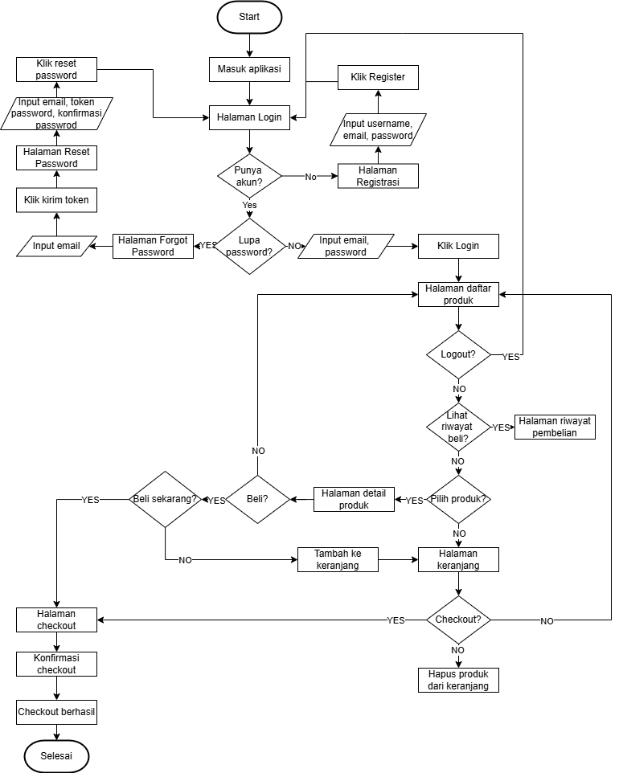

---

## 📱 UI Aplikasi (Emulator)

### 🔐 Otentikasi

| Login | Register |
|-------|----------|
| 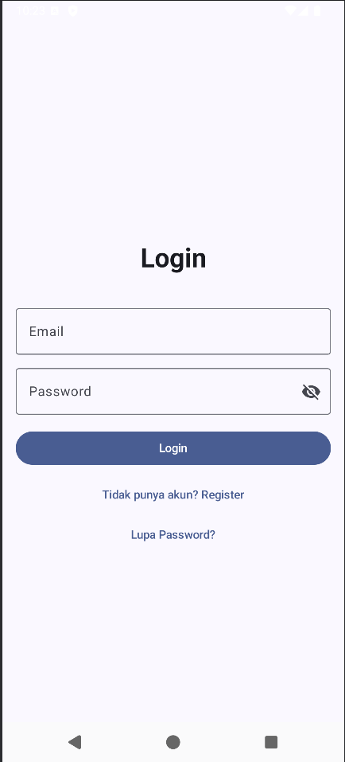 | 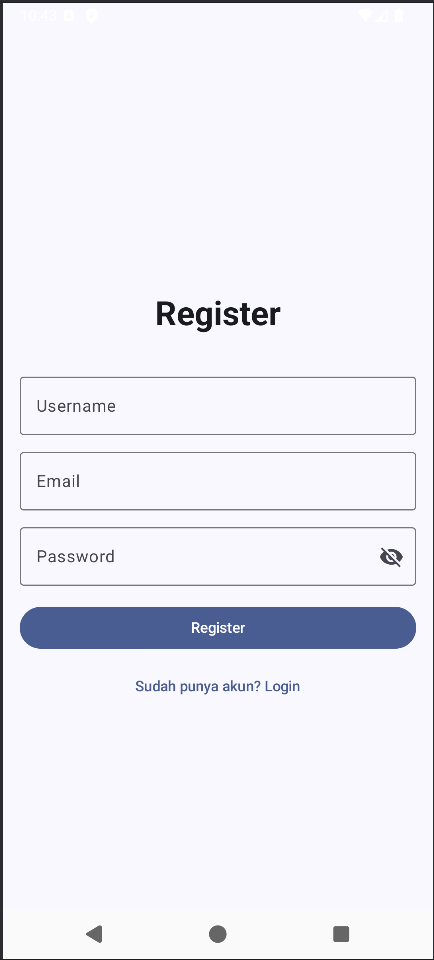 |

| Lupa Password | Reset Password |
|---------------|----------------|
| 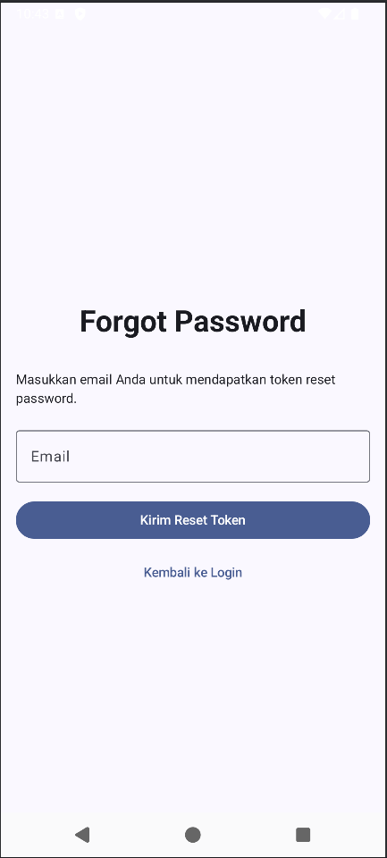 | 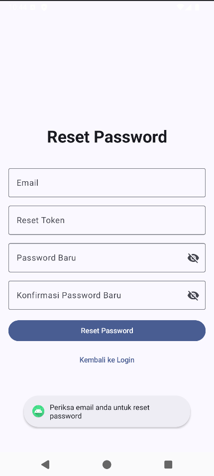 |

---

### 📦 Inventori

| Daftar Produk | Detail Produk |
|---------------|---------------|
| 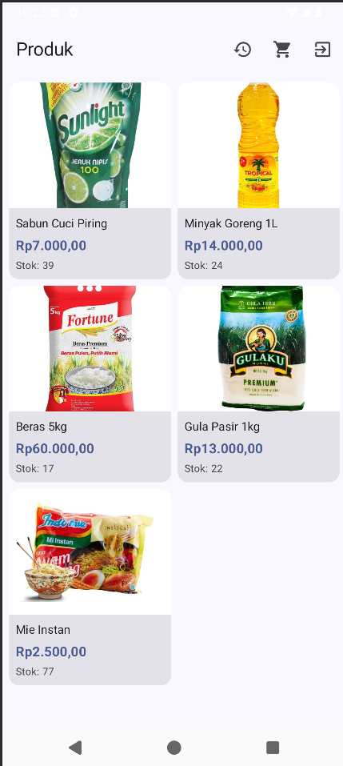 | 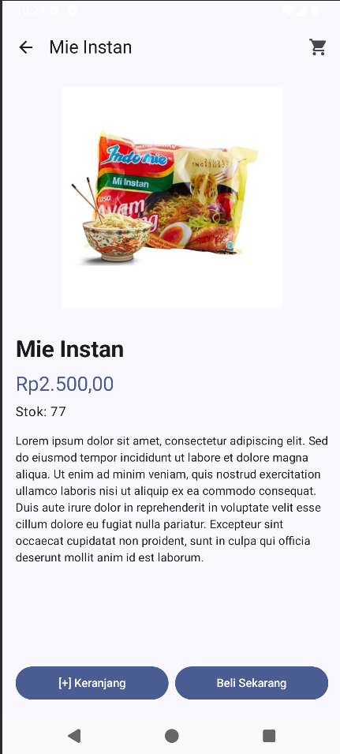 |

| Keranjang | Checkout |
|-----------|----------|
| 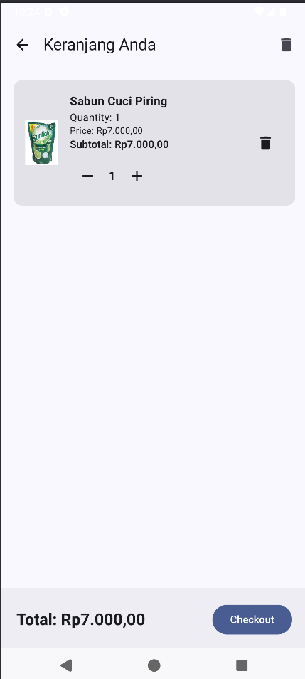 | 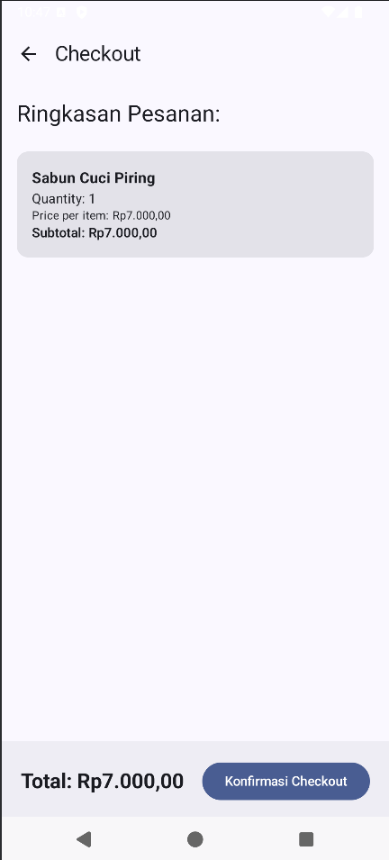 |

| Pembayaran | Riwayat Pembelian |
|------------|-------------------|
| 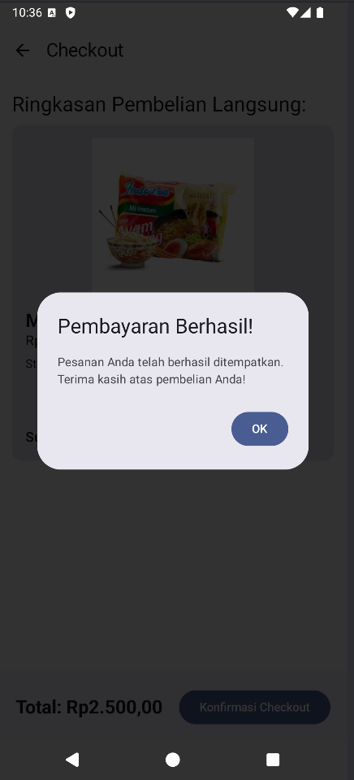 | 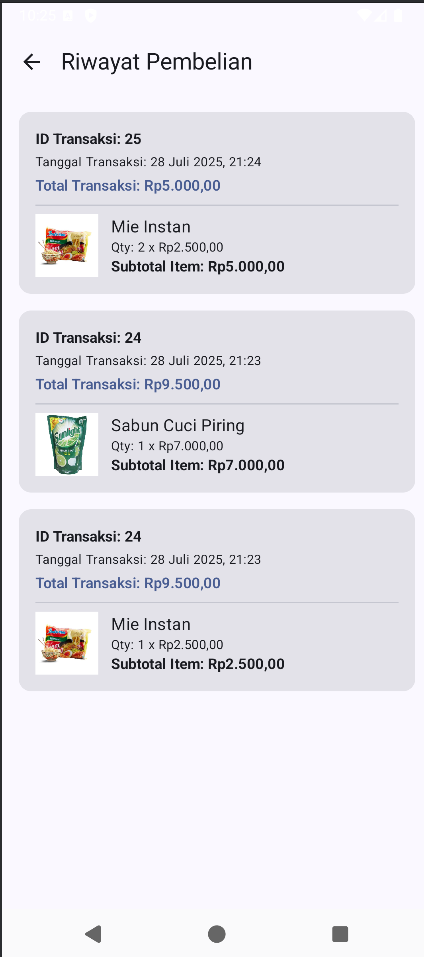 |

---

## ⚠️ Catatan

> Gantilah IP `0.0.0.0` yang terdapat di file `Constants.kt` dan `network_security_config.xml` dengan alamat IP lokal perangkat kamu (misalnya: `192.168.1.10`) agar aplikasi dapat terhubung dengan server backend lokal.

---

## 📚 Lisensi

Proyek ini dibuat untuk keperluan pembelajaran dan tidak untuk tujuan komersial.

---